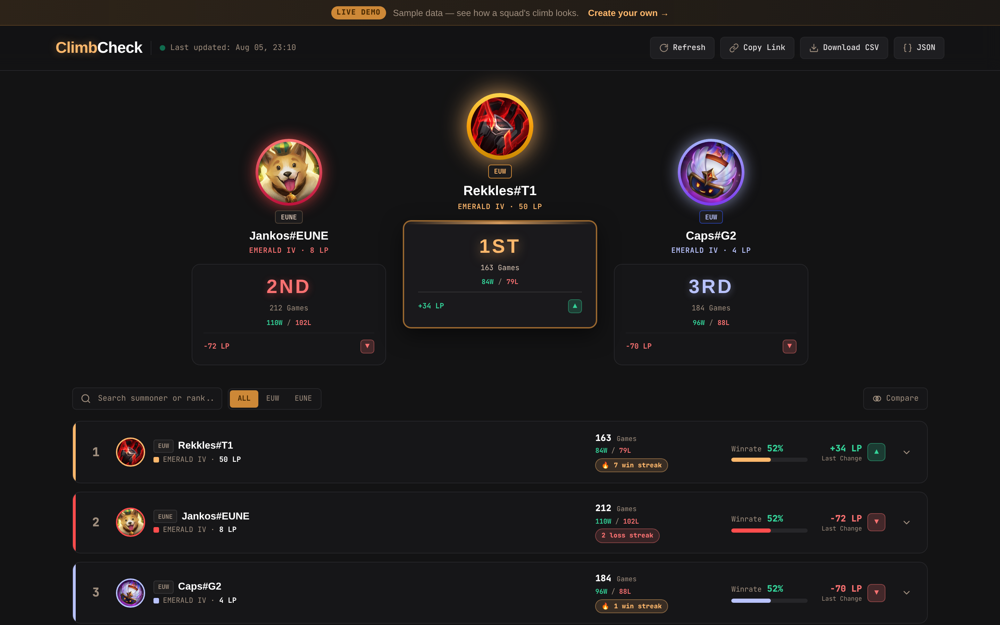

# ClimbCheck 🏔️

> Turn your squad's ranked grind into a live, shareable LP leaderboard.

ClimbCheck is a full-stack web app for tracking the **solo queue climb** of a group of friends
in League of Legends. Create a dashboard, add your friends' Riot IDs (EUW / EUNE), share a single
link — and everyone sees the same live ranking sorted by rank, with winrates, match history,
LP progression charts and side-by-side player comparisons. No accounts, no logins.

> **🔗 Live:** [climbcheck.dolien.pl](https://climbcheck.dolien.pl) — open the live demo, no account needed.

<p align="center">
  
</p>

[](https://github.com/dolienn/climbcheck/blob/develop/CHANGELOG.md)
[](https://climbcheck.dolien.pl)
[](https://github.com/dolienn/climbcheck/actions/workflows/ci.yml)
[](https://github.com/dolienn/climbcheck)
[](https://github.com/dolienn/climbcheck)
[](https://github.com/dolienn/climbcheck)
[](CHANGELOG.md)

---

## ✨ Features

- **Live LP leaderboard** — sorted by rank (not raw LP), podium for the top 3, last LP change
  per player, auto-refresh every 5 minutes, skeleton loading, fully mobile-responsive.
- **Match insights** — click any player to see their recent matches: champion, KDA, CS,
  game duration, W/L, plus win streak and top champions.
- **LP Progression Trends** — a 30-day chart tracking each player's rank and LP over time
  (snapshots are captured automatically by a scheduled job and after every detected game).
- **Compare players** — select up to 3 players and compare LP, winrate, KDA, streaks and
  recent matches side by side.
- **Shareable dashboards** — one unique link per dashboard; the creator gets a management link
  (`adminToken`) for adding/removing players. Mutations are protected with `X-Admin-Token`.
- **CSV / JSON export** — download the whole ranking for spreadsheets or analysis.
- **Rate limiting** — sliding-window limiter on the public API with `X-RateLimit-*` headers,
  plus exponential backoff with `X-RateLimit-*` header handling for the Riot API.
- **Live demo** — a fully client-side demo dashboard (`/demo`) with realistic sample data,
  so the project can be explored without touching the Riot API.

## 🧰 Tech stack

| Layer     | Tech                                                                 |
| --------- | -------------------------------------------------------------------- |
| Frontend  | Angular (standalone components, signals), SCSS design tokens         |
| Backend   | Java 21, Spring Boot (Web, Data JPA, Validation, Flyway, Scheduling) |
| Database  | PostgreSQL                                                           |
| External  | Riot Games API (account-v1, league-v4, match-v5)                     |
| Infra     | Docker Compose, Caddy (auto-HTTPS), GitHub Actions CI/CD             |
| Testing   | JUnit 5 + Mockito, Vitest, Playwright (e2e)                          |

## 🏗 Architecture

Monorepo, **feature-first packages** (`dashboard/`, `player/`, `riot/`, `exception/`), each with
controller → service → repository → dto → mapper layering, constructor injection and a global
exception handler. The frontend is a **git submodule** (`dolienn/climbcheck-frontend`).

```
climbcheck/
├── backend/          # Spring Boot app (Java 21, Flyway migrations V1..V6)
│   └── src/main/resources/db/migration/   # schema + LP snapshots + indexes
├── frontend/         # Angular app (git submodule)
├── e2e/              # Playwright: full flow + rate-limit tests
├── CHANGELOG.md      # versioned release history (Keep a Changelog)
├── scripts/dev.sh    # one-command local stack (Postgres + backend + frontend)
├── docs/DEPLOYMENT.md # production deployment guide (Riot key, DNS, HTTPS)
└── docker-compose.prod.yml  # production: Postgres + backend + Caddy
```

## 🚀 Quick start (local dev)

```bash
# 1. API key (dev key is fine locally)
cp env.example .env        # fill in RIOT_API_KEY

# 2. One command: Postgres (port 5433) + backend (8081) + frontend (4200)
./scripts/dev.sh
```

Then open <http://localhost:4200>. The frontend proxies `/api` to the backend.

Or run pieces manually:

```bash
docker compose up -d db
cd backend && ./mvnw spring-boot:run            # http://localhost:8081
cd frontend && npm install && npm start          # http://localhost:4200
```

## 🧪 Testing

```bash
cd backend && ./mvnw test          # unit + web tests (JUnit 5, Mockito, @WebMvcTest)
cd frontend && npm test            # unit tests (Vitest)
bash e2e/run.sh                    # e2e tests (Playwright, spins its own stack)
```

Every push to `develop` runs all three suites in GitHub Actions (`Backend — build + mvn test`,
`Frontend — build + ng test`, `E2E — Playwright full flow`). Pushes to `main` additionally
trigger a **deploy** job (SSH → `docker compose up -d --build`).

## 🌍 Deployment

The app is live at **[https://climbcheck.dolien.pl](https://climbcheck.dolien.pl)**. Production
runs on Docker Compose with **Caddy** handling automatic HTTPS (Let's Encrypt), SPA routing and
security headers. See **[docs/DEPLOYMENT.md](docs/DEPLOYMENT.md)** for the full guide: applying
for a production Riot API key, DNS setup, server bootstrap and the CI deploy job.

## ⚠️ Disclaimer

ClimbCheck isn't endorsed by Riot Games and doesn't reflect the views or opinions of Riot Games
or anyone officially involved in producing or managing Riot Games properties. Riot Games and all
associated properties are trademarks or registered trademarks of Riot Games, Inc.
